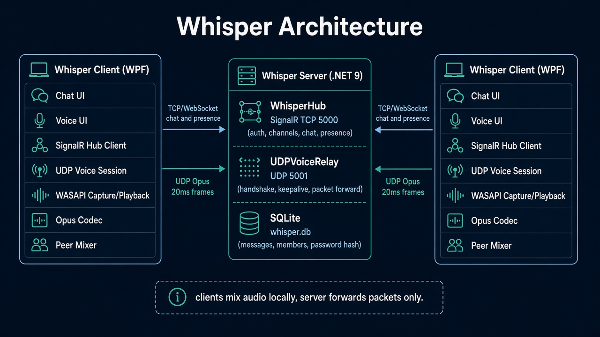
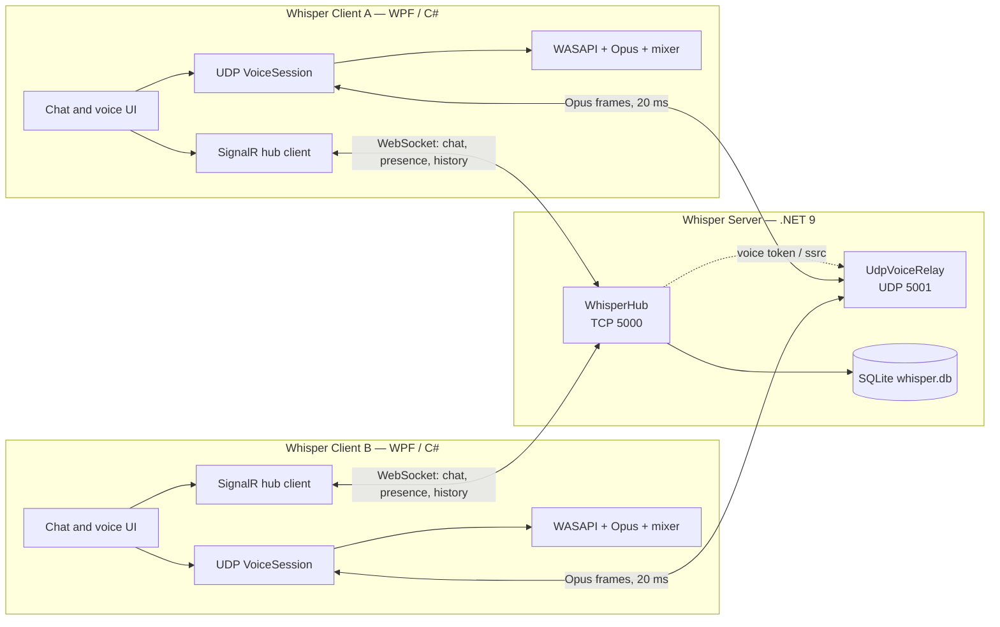

# Whisper

Self-hosted **VoIP** server and Windows client written in **C#** (.NET 9). You run the
server yourself, so the audio and the message history stay on hardware you control — no
accounts with anyone else, no third-party relay.

Two parts:

- **`whisper-server`** — a console application. Chat, presence, and history over TCP; a
  voice relay over UDP; everything persisted to a single SQLite file.
- **`Whisper.exe`** — a Windows desktop client with saved server profiles.

## Architecture

Voice and chat travel over separate connections, because they want opposite things from the
network. Chat must never lose a message, so it uses TCP (SignalR over WebSockets). Voice
must never wait for a retransmission — a late audio frame is worse than a missing one — so
it uses a minimal UDP protocol with no retries.





The server relays voice rather than mixing it: it forwards each Opus packet, untouched, to
the other members of the sender's channel, and each client mixes what it receives. That
keeps server CPU near zero, at the cost of bandwidth growing with the square of the number
of people talking at once. On a LAN that is comfortable up to roughly 16 simultaneous
speakers.

## Running the server

```powershell
./whisper-server.exe --name "My Server" --password "something-long"
```

On first run it creates `data/whisper.db`, seeds the default channels, and hashes the
password. **If you omit `--password`, one is generated and printed to the console** — copy
it before clearing the window.

The startup banner prints every address the server is reachable on, which is what you hand
to the people connecting.

### Launch flags

| Flag | Default | What it does |
| --- | --- | --- |
| `--port <n>` | `5000` | TCP port for chat, presence, and history. |
| `--voice-port <n>` | `5001` | UDP port for voice. |
| `--name <text>` | `Whisper Server` | Name clients see. |
| `--password <text>` | generated | Shared server password. Applied on first run only. |
| `--reset-password true` | off | Applies `--password` to an existing database. |
| `--data <path>` | `data` | Directory for `whisper.db` and logs. |
| `--max-members <n>` | `64` | Connection cap. |
| `--cert <path.pfx>` | none | Serves the hub over HTTPS/WSS. |
| `--cert-password <text>` | none | Password for the PFX. |

Anything in `appsettings.json` can also be set this way; the file sits next to the
executable and flags override it. Rate limits and the voice packet budget are configured
there rather than as flags, since they are rarely changed.

Changing the password later:

```powershell
./whisper-server.exe --password "the-new-one" --reset-password true
```

### Opening the ports

Whisper does not use STUN or TURN, so reaching a server from outside its own network needs
two port forwards on the router, both to the machine running the server:

| Protocol | Port | Carries |
| --- | --- | --- |
| TCP | 5000 | Chat, presence, history, voice tokens |
| UDP | 5001 | Voice audio |

**Both are required.** Forwarding only TCP produces the most common failure: chat works,
the member list populates, and joining a voice channel reports that voice could not
connect. The client says so explicitly rather than leaving you to guess.

On the same LAN, no forwarding is needed — just allow the server through Windows Firewall
when prompted, for both TCP and UDP.

### HTTPS

Optional, and only worth it if chat crosses a network you do not trust. Voice is not
encrypted either way, so this protects messages rather than calls.

```powershell
./whisper-server.exe --cert .\whisper.pfx --cert-password "pfx-password"
```

Clients then need **Server uses HTTPS** ticked. A self-signed certificate will be rejected
by Windows unless the profile also ticks **Trust its self-signed certificate**, which is
per-profile on purpose: trusting one server's certificate should not weaken TLS everywhere.

## Running the client

Launch `Whisper.exe`, add a profile with the server's address, port, and the name others
will see, then connect.

Saved profiles live in `%APPDATA%\Whisper\profiles.json`. Remembered passwords are
encrypted with DPAPI, tied to your Windows account — the file is useless if copied to
another machine, and the client falls back to prompting rather than crashing when it cannot
decrypt one.

**Audio** is configured from the *Audio* button in the status bar: input and output devices,
push-to-talk versus voice activation, the activation threshold with a live input meter,
input gain, and jitter buffer depth. Raise the jitter buffer if audio breaks up; each frame
adds 20 ms of delay.

## Building from source

Needs the .NET 9 SDK. The client is Windows-only (WPF); the server is not, though it has
only been exercised on Windows.

```powershell
./build.ps1                        # restore, build, test, publish, zip
./build.ps1 -SkipIntegrationTests  # fast inner loop
./build.ps1 -SkipTests             # publish only
```

Artifacts land in `artifacts/` as self-contained single-file builds — no .NET runtime
needed on the target machine.

Or directly:

```powershell
dotnet test                                  # 269 unit + 28 integration tests
dotnet run --project src/Whisper.Server
dotnet run --project src/Whisper.Client
```

### Tests

`Whisper.Tests` is the fast suite: packet codec, routing rules, jitter buffer, Opus
round-trips against synthetic sine waves, rate limiters, and view models driven through
fakes. No sockets, no audio devices, no sleeping — anything time-dependent runs on
`FakeTimeProvider`.

`Whisper.IntegrationTests` stands up the real server in-process and drives it with real
SignalR clients and real UDP sockets over loopback, covering authentication, broadcast
fan-out, history across reconnects, relay forwarding between channels, and each abuse case
the hardening guards against.

```powershell
dotnet test --filter "Category!=Integration"
```

## Release checklist

Automated tests cover the protocol and the logic, but not devices, routers, or real
networks. Before calling a build good:

- [ ] Two machines on one LAN: chat both ways, voice both ways, speaking indicators track
      who is actually talking.
- [ ] One client over a forwarded port from outside the network.
- [ ] TCP forwarded but UDP blocked: chat works and joining voice fails with a message
      naming the UDP port, rather than hanging.
- [ ] Latency and loss injected with [clumsy](https://jagt.github.io/clumsy/): speech stays
      intelligible at 100 ms RTT and 5% loss.
- [ ] Unplug a headset mid-call: the client reports the device failure and stays usable.
- [ ] Restart the server: clients report the shutdown, reconnect, and history is intact.
- [ ] Wrong password is refused, and repeated guesses get throttled.

## Deliberately not included

Per-user accounts and roles, encrypted voice, video and screen share, server-side mixing,
NAT traversal, and a non-Windows client. The business logic lives in `Whisper.Shared` and
the client's services layer, so a cross-platform UI later would be a UI port rather than a
rewrite.
